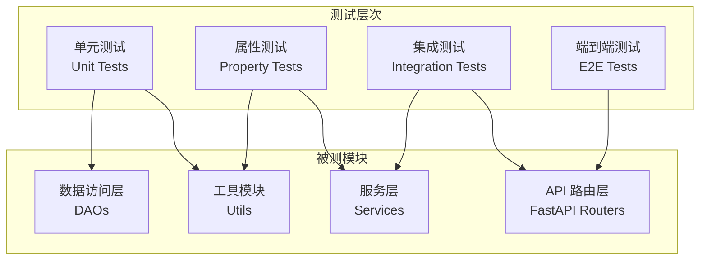

# Design Document: BiliNote System Testing

## Overview

本设计文档定义了 BiliNote 项目的系统性测试架构，包括单元测试、属性测试、集成测试和性能测试的实现方案。测试框架将覆盖后端 API、核心服务模块、数据持久化和错误处理等关键功能。

## Architecture



### 测试目录结构

```
backend/
├── tests/
│   ├── __init__.py
│   ├── conftest.py              # pytest 配置和 fixtures
│   ├── unit/                    # 单元测试
│   │   ├── test_url_parser.py
│   │   ├── test_response.py
│   │   └── test_provider_service.py
│   ├── property/                # 属性测试
│   │   ├── test_url_parsing_props.py
│   │   ├── test_api_key_masking_props.py
│   │   ├── test_screenshot_extraction_props.py
│   │   └── test_task_id_props.py
│   └── integration/             # 集成测试
│       ├── test_api_health.py
│       ├── test_provider_api.py
│       └── test_task_status.py
```

## Components and Interfaces

### 1. 测试配置模块 (conftest.py)

提供共享的 pytest fixtures：

```python
# 测试数据库 fixture
@pytest.fixture
def test_db():
    """创建内存数据库用于测试"""
    pass

# FastAPI 测试客户端 fixture
@pytest.fixture
def client():
    """创建 TestClient 实例"""
    pass

# Provider 测试数据 fixture
@pytest.fixture
def sample_provider():
    """生成测试用 Provider 数据"""
    pass
```

### 2. URL 解析测试模块

测试 `app/utils/url_parser.py` 中的 URL 解析逻辑：

- `extract_video_id(url, platform)` - 从 URL 提取视频 ID
- `is_supported_video_url(url)` - 验证 URL 是否支持

### 3. Provider 服务测试模块

测试 `app/services/provider.py` 中的服务逻辑：

- `mask_key(key)` - API Key 脱敏
- `add_provider()` - 添加提供商
- `update_provider()` - 更新提供商
- `serialize_provider_safe()` - 安全序列化

### 4. 笔记生成测试模块

测试 `app/services/note.py` 中的核心逻辑：

- `_extract_screenshot_timestamps(markdown)` - 截图时间戳提取
- `_update_status()` - 状态更新

### 5. 响应包装测试模块

测试 `app/utils/response.py` 中的响应格式：

- `ResponseWrapper.success()` - 成功响应格式
- `ResponseWrapper.error()` - 错误响应格式

## Data Models

### 测试数据生成策略

```python
# Provider 生成策略
provider_strategy = st.fixed_dictionaries({
    "name": st.text(min_size=1, max_size=50),
    "api_key": st.text(min_size=8, max_size=128),
    "base_url": st.from_regex(r"https?://[a-z0-9.-]+(/[a-z0-9/-]*)?", fullmatch=True),
    "type": st.sampled_from(["openai", "deepseek", "qwen"]),
})

# URL 生成策略
bilibili_url_strategy = st.from_regex(
    r"https://(www\.)?bilibili\.com/video/BV[a-zA-Z0-9]{10}",
    fullmatch=True
)

youtube_url_strategy = st.from_regex(
    r"https://(www\.)?youtube\.com/watch\?v=[a-zA-Z0-9_-]{11}",
    fullmatch=True
)
```

## Correctness Properties

*A property is a characteristic or behavior that should hold true across all valid executions of a system-essentially, a formal statement about what the system should do. Properties serve as the bridge between human-readable specifications and machine-verifiable correctness guarantees.*

### Property 1: URL 解析一致性

*For any* 有效的视频 URL（Bilibili/YouTube/抖音），URL 解析器应该能够提取出非空的视频 ID，且对同一 URL 多次解析应返回相同结果。

**Validates: Requirements 2.1, 2.2, 2.3**

### Property 2: 无效 URL 拒绝

*For any* 不符合支持平台格式的 URL，URL 验证器应该返回 False 或抛出明确的错误。

**Validates: Requirements 2.4**

### Property 3: API Key 脱敏保护

*For any* 长度大于等于 8 的 API Key，脱敏后的结果应该只显示前 4 位和后 4 位，中间用星号替代，且脱敏后的长度与原始长度相同。

**Validates: Requirements 5.4**

### Property 4: 截图时间戳提取准确性

*For any* 包含 `*Screenshot-mm:ss` 或 `Screenshot-[mm:ss]` 格式标记的 Markdown 文本，提取函数应该返回正确的时间戳（秒数 = mm * 60 + ss）。

**Validates: Requirements 4.3**

### Property 5: Task ID 唯一性

*For any* 批量生成的 task_id 集合，所有 ID 应该互不相同（使用 UUID）。

**Validates: Requirements 6.1**

### Property 6: Provider 数据持久化一致性

*For any* 有效的 Provider 数据，插入数据库后查询应该返回相同的数据（除了自动生成的字段如 created_at）。

**Validates: Requirements 5.1, 5.2, 10.2**

### Property 7: 错误响应格式一致性

*For any* 错误消息和错误码，`ResponseWrapper.error()` 返回的 JSON 应该包含 `code`、`msg` 和 `data` 字段。

**Validates: Requirements 9.1**

### Property 8: 任务列表时间排序

*For any* 插入顺序的任务记录，查询结果应该按创建时间降序排列。

**Validates: Requirements 10.4**

## Error Handling

### 测试中的错误处理策略

1. **预期异常测试**：使用 `pytest.raises()` 验证特定异常
2. **边界条件测试**：空输入、超长输入、特殊字符
3. **错误消息验证**：确保错误消息包含有用的调试信息

```python
# 示例：预期异常测试
def test_invalid_url_raises_error():
    with pytest.raises(NoteError) as exc_info:
        validate_video_url("invalid-url")
    assert exc_info.value.code == NoteErrorEnum.PLATFORM_NOT_SUPPORTED.code
```

## Testing Strategy

### 单元测试

- 使用 `pytest` 作为测试框架
- 测试独立函数和方法
- 使用 mock 隔离外部依赖
- 覆盖正常路径和边界条件

### 属性测试

- 使用 `hypothesis` 作为属性测试库
- 每个属性测试运行至少 100 次迭代
- 使用自定义策略生成测试数据
- 每个属性测试必须标注对应的需求编号

```python
# 属性测试示例
@given(api_key=st.text(min_size=8, max_size=128))
@settings(max_examples=100)
def test_api_key_masking_preserves_length(api_key):
    """
    **Feature: system-testing, Property 3: API Key 脱敏保护**
    """
    masked = ProviderService.mask_key(api_key)
    assert len(masked) == len(api_key)
```

### 集成测试

- 使用 `TestClient` 测试 FastAPI 端点
- 使用内存数据库进行数据库测试
- 验证 API 响应格式和状态码

### 测试执行

```bash
# 运行所有测试
pytest backend/tests/ -v

# 运行属性测试
pytest backend/tests/property/ -v

# 运行并生成覆盖率报告
pytest backend/tests/ --cov=backend/app --cov-report=html
```

### 依赖项

```
# requirements-dev.txt
pytest>=7.0.0
pytest-cov>=4.0.0
hypothesis>=6.0.0
httpx>=0.24.0  # 用于 TestClient
```
